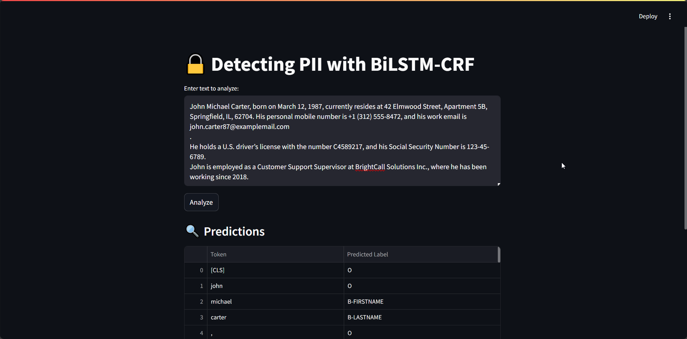

# PIIDetector 🔒
Detecting Personally Identifiable Information (PII) using BiLSTM-CRF model

## 🚀 Demo



[Watch Demo Video](./demo/demo.mp4)

## ✨ Features

- **PII Detection**: Identify various types of Personally Identifiable Information in text
- **BiLSTM-CRF Model**: Utilizes a powerful deep learning model for sequence labeling
- **Streamlit Web Interface**: User-friendly interface for easy interaction
- **Multiple PII Types**: Detects various PII entities including names, addresses, financial information, and more

## 📦 Installation

1. **Clone the repository**
   ```bash
   git clone https://github.com/DeepActionPotential/PIIDetector
   cd PIIDetector
   ```

2. **Create and activate a virtual environment**
   ```bash
   # Create a virtual environment
   python -m venv .venv
   
   # Activate it
   # On Linux/Mac:
   source .venv/bin/activate
   # On Windows:
   .venv\Scripts\activate
   ```

3. **Install dependencies**
   ```bash
   pip install -r requirements.txt
   ```

## 🚀 Usage

1. **Run the Streamlit app**
   ```bash
   streamlit run app.py
   ```

2. **Enter text** in the text area and click "Analyze" to detect PII entities

3. **View results** in the table showing tokens and their predicted PII labels

## 🛠 Configuration

The application uses a pre-trained BiLSTM-CRF model located in the `models/` directory. The model supports the following PII entity types:

- Personal Information (names, age, gender, etc.)
- Contact Information (emails, phone numbers, addresses)
- Financial Information (credit cards, account numbers, IBAN, etc.)
- Identification Numbers (SSN, passport numbers, etc.)
- And many more...

## 🤝 Contributing

Contributions are welcome! Please feel free to submit a Pull Request.

1. Fork the repository
2. Create your feature branch (`git checkout -b feature/AmazingFeature`)
3. Commit your changes (`git commit -m 'Add some AmazingFeature'`)
4. Push to the branch (`git push origin feature/AmazingFeature`)
5. Open a Pull Request

## 📄 License

This project is licensed under the MIT License - see the [LICENSE](LICENSE) file for details.

## 🙏 Acknowledgements

- [Hugging Face Transformers](https://huggingface.co/transformers/)
- [PyTorch](https://pytorch.org/)
- [Streamlit](https://streamlit.io/)
